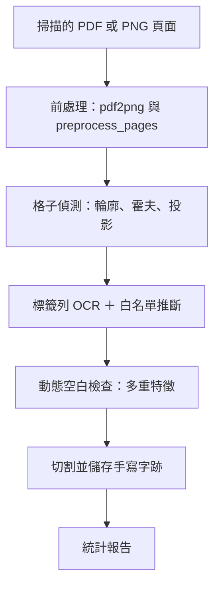

# 📘 CHR_Classifier

[English Version](README.md)

## 📖 簡介
CHR Classifier 是一個基於 OCR 的流程系統，專門用於從補習班掃描的生字練習簿中，辨識並擷取 **繁體中文手寫字跡**。 


此系統會自動處理掃描影像，偵測格子結構，利用 OCR 與白名單推斷進行分類，並將切割出的手寫字樣儲存為資料集。  

---

## 🏫 專案背景
本專案最初開發於 **WASN 實驗室補習班計畫**，該計畫提供了生字練習簿的掃描檔。  


系統的用途是作為 **資料標註與分類工具**，以蒐集常見繁體中文字，並用於後續研究。  

⚠️ **注意**：由於計畫限制，原始的補習班掃描資料 **無法公開**。  
若要使用本專案，請自行準備 **自有的掃描練習簿或文件** 作為輸入，敬請見諒。  

- 目前 **格子偵測與覆蓋率**：**99.99%**  
- 目前 **OCR 分類準確率**：約 **95%**  
- OCR 引擎：**TesseractOCR**（針對繁體中文進行 fine-tune）  

---

## ✨ 功能特色


- 🧩 **格子偵測**：多通道方法（輪廓分析、霍夫變換、投影剖面）。  
- 🔍 **嚴格空白檢測**：利用多重特徵品質控管（持久度遮罩、邊緣密度、連通元件），避免存下空白或雜訊格子。  
- 📝 **白名單推斷**：支援字元序列，自訂起始錨點。  
- 📊 **完整統計報告**：包含儲存率、資料產出率、低存量欄位紀錄。  
- ⚡ **自動化流程**：若需要會自動執行預處理（`pdf2png.py`, `preprocess_pages.py`）。  

---

## 🗂 檔案結構

CHR_classifier
├── main.py # main code
├── config.py # all the config
├── whitelist.py # whitelist process
├── whitelist.txt # Character whitelist
├── pdf2png.py # Convert PDF to PNG if needed
├── preprocess_pages.py # Page preprocessing utility
├── detect_grid.py # Grid detection debugger
├── ocr.py # Optical Character Recognition and preprocess to Chinese words 
├── report.py # output statistics
├── data/ # folder originally put each page as .png file
└── pdf/ # folder originally put the pages as .pdf file
└── datasets/ to output the folders of result


---

## 🔧 系統需求

   ```bash
   pip install -r requirements.txt
   ```

- Python 3.8+
- numpy>=1.21.0
- [opencv-python>=4.5.0](https://opencv.org/)
- pdf2image>=1.16.3
- Pillow>=9.0.0
- bayesian-optimization
- [pytesseract>=0.3.10](https://github.com/madmaze/pytesseract)

---

## 🚀 使用方法

1. Clone 這份 repository:
   ```bash
   git clone https://github.com/Daniel930902/CHR_classifier
   ```

2. 準備資料，將掃描過的 PDF 檔放入 pdf/ 資料夾，或者，將轉換後的 PNG 頁面放入 data/{pdf_name}/ 資料夾。(兩者擇一即可)

  （⚠️ 因原始補習班資料不公開，請使用 自有資料）

3. 到CHR_classifier的目錄下
   ```bash
   cd CHR_classifier
   ```

4. 執行分類程式：
   ```bash
   python CHR_classifier.py
   ```

5. 執行完後，查看輸出結果，切割後的手寫字跡圖片會輸出到指定資料夾。

    例如：
    ```
    ./CHR_classifier/{output_folder}/

    ```

    ```
    ./CHR_classifier/250928/
    ```

---

## 🔄 處理流程



---

## 📊 範例輸出

* 按字元整理的手寫字跡圖片

* 標籤 OCR 與格子偵測的除錯圖

* 最終統計報告，包含儲存率與產出率

---

## 🙏 致謝

本專案使用了針對繁體中文 fine-tune 的 Tesseract 模型：
[ tessdata_chi ]( gumblex/tessdata_chi )

---

## 📝 備註
此 README 在 ChatGPT 5 協助下撰寫與完成。